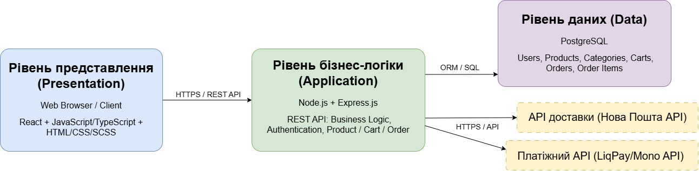
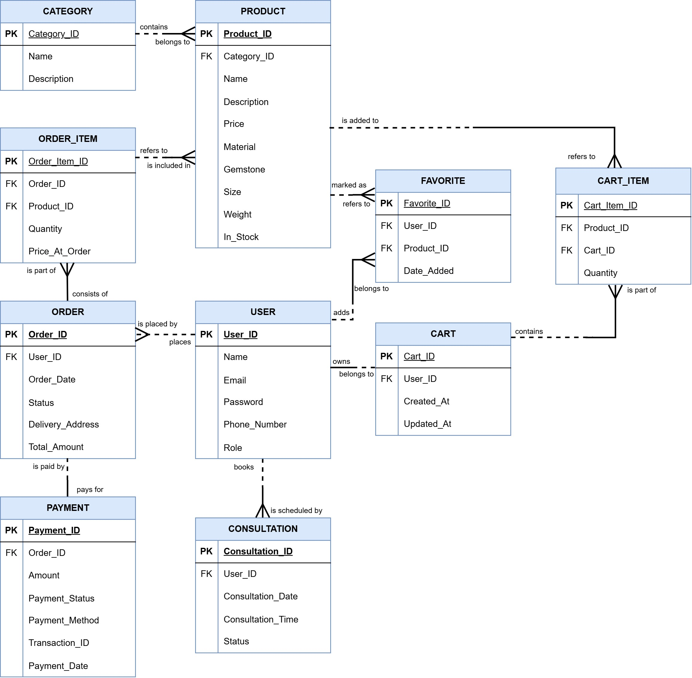
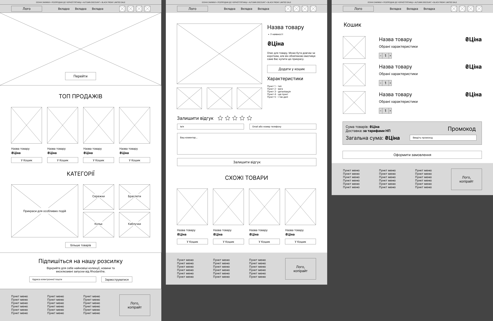
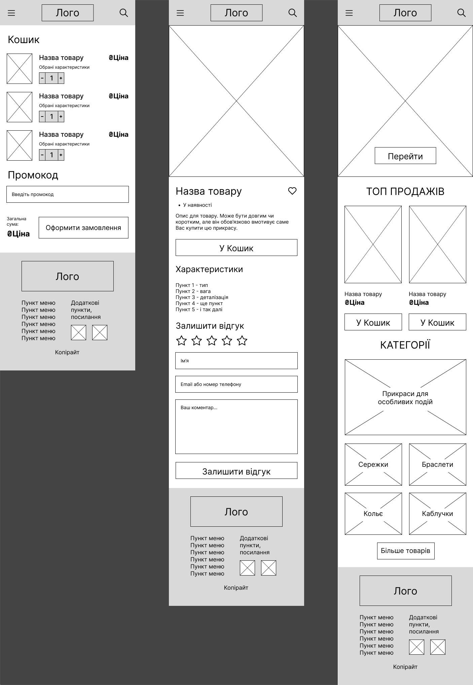
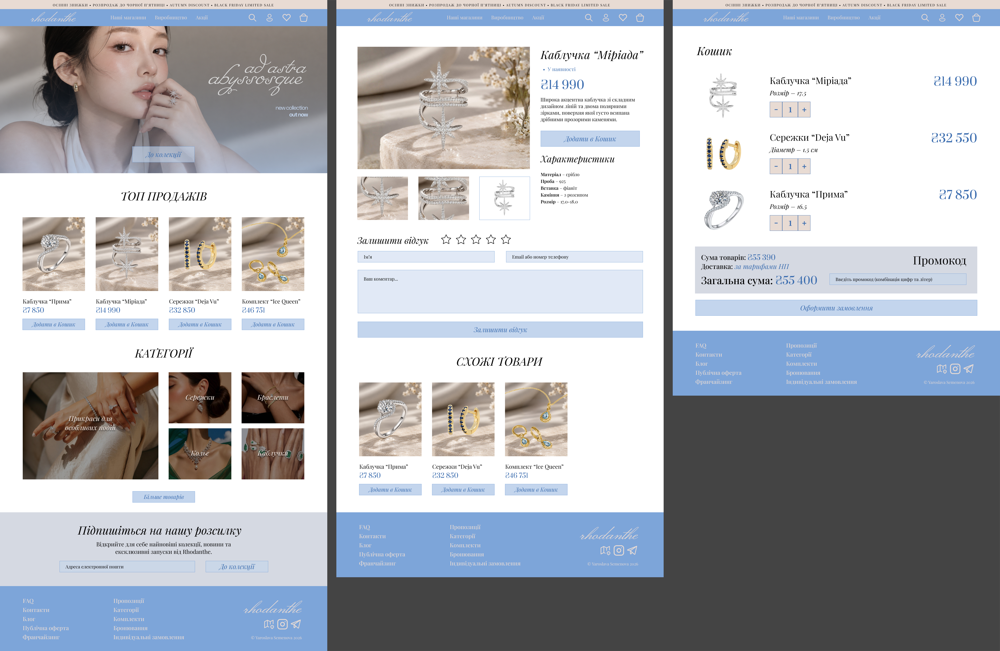
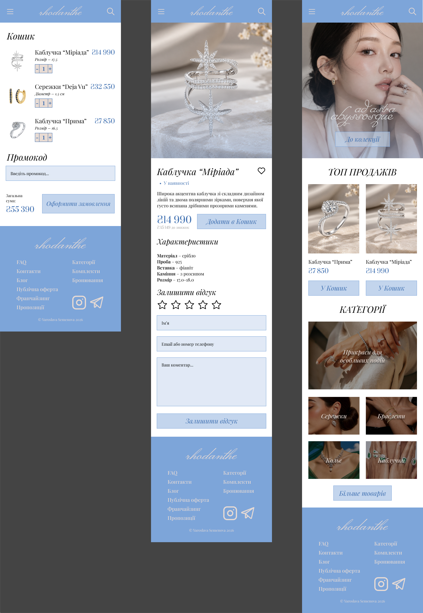

# Матеріали та результати виконання ЛР №3

### Архітектурний стиль та архітектурна діаграма
Обраний архітектурний стиль – трирівнева архітектура (3-tier).

Рівень представлення (клієнтська частина – вебінтерфейс 
для гостей, клієнтів і адміністраторів) відповідає лише 
за відображення даних і збір введення користувача. 
Рівень бізнес-логіки містить усі правила: фільтрацію 
каталогу, додавання до кошика, оформлення замовлення, 
перевірку наявності, роботу з обраним, запис на 
консультацію, зміну статусів і формування звітів. 
Рівень даних відповідає за збереження інформації в 
реляційній базі та взаємодію з нею через чіткий інтерфейс доступу.

### ER-діаграма бази даних
ER-діаграма відображає структуру бази даних програмної системи
ювелірного салону Rhodanthe. Діаграма будується навколо 
основних об’єктів предметної області, визначених вимогами: 
користувачі, товари з категоріями, кошик, замовлення з оплатою,
список обраного та консультації.

### Каркас UX/UI (Wireframes)

Розроблено wireframes (низькодеталізовані макети) для 
трьох екранів: головної сторінки, картки товару та кошика. 
Каркас побудовано у двох версіях 
(для десктопного та мобільного відображення).

### Макети UX/UI (Mockups)

На основі каркасу створено статичні макети (mockups).
На цьому етапі визначено колірну гаму, шрифти та конкретне
оформлення елементів. Для сайту Rhodanthe я використала 
кольори #7DA5DA та #E8DBD4, а основним шрифтом обрала 
Playfair Display.

